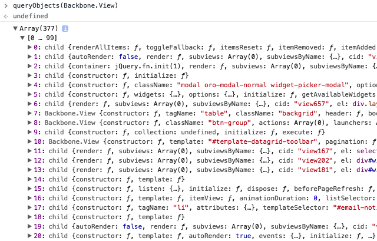

# Enforce to use named constructors (named-constructor)

Backbone's `extend` method creates stub constructor method with `child` name, if there's no specific constructor defined.
That lead to the issue that all instances created with the stub constructor are shown as `child`.

Execute in the console of Chrome browser the command
```js
    queryObjects(Backbone.View)
``` 
And see similar result



It is hard to answer: Which View is which? Are there Views that have to be removed from memory already? And etc.

## Rule Details

The rule is aimed to enforce to use named constructor in order to give proper names to the instances.

Examples of **incorrect** code for this rule:

```js
    var BarClass = FooClass.extend({
        initialize: function() {
            // ...
        }
    });
```

Examples of **correct** code for this rule:

```js
    var BarClass = FooClass.extend({
        constructor: function BarClass() {
            BarClass.__super__.apply(this, arguments);
        },
        
        initialize: function () {
            // ...
        }
    });
```
